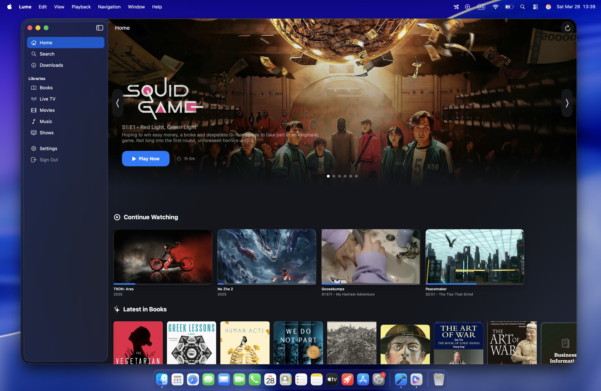
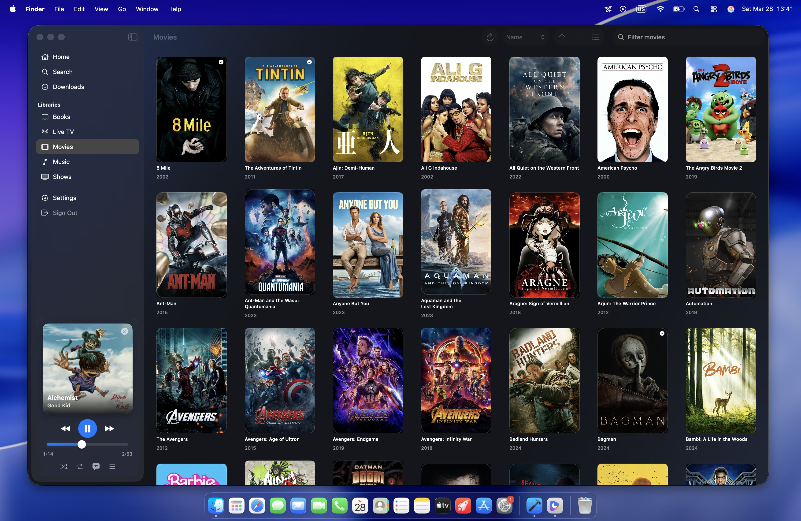
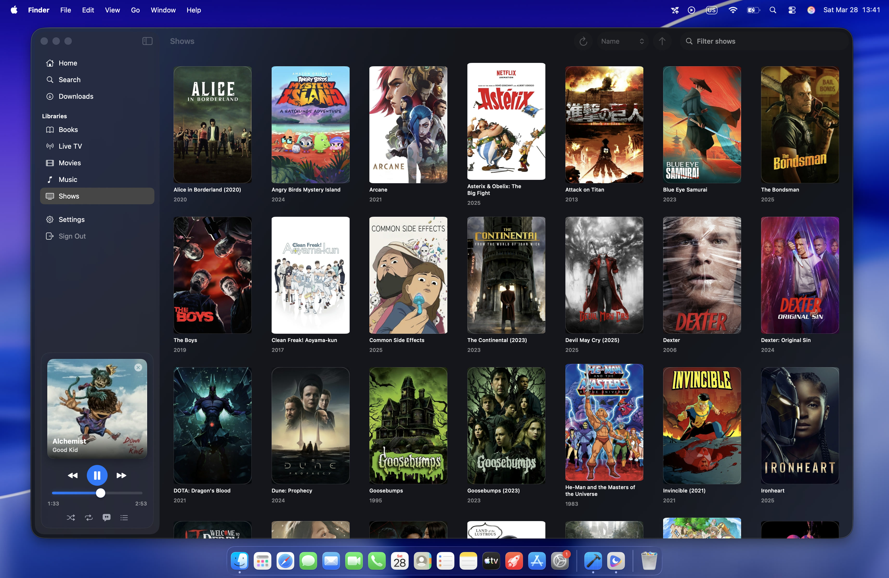
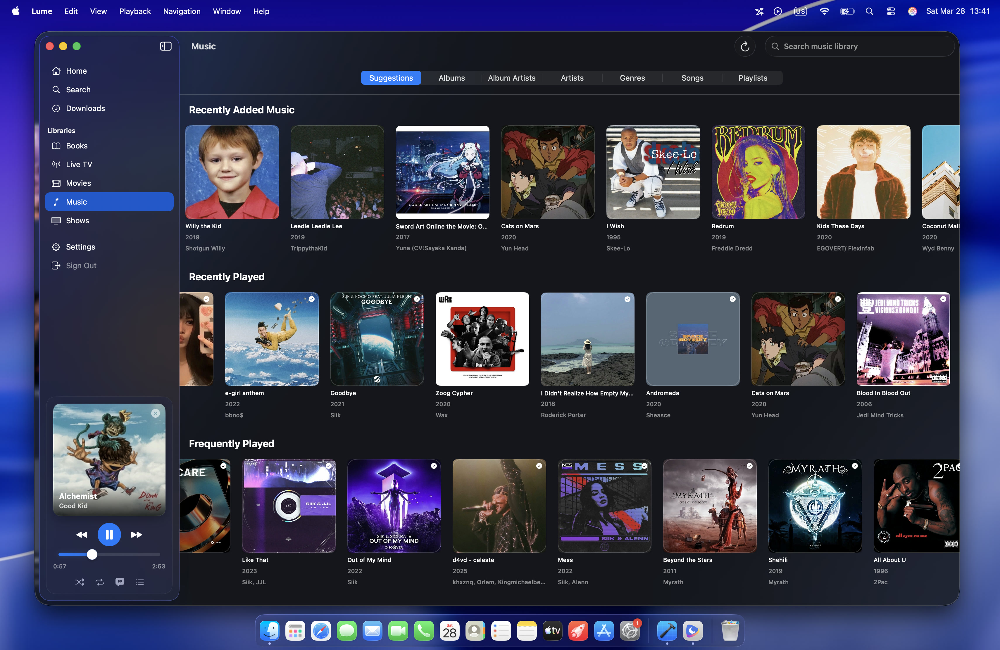
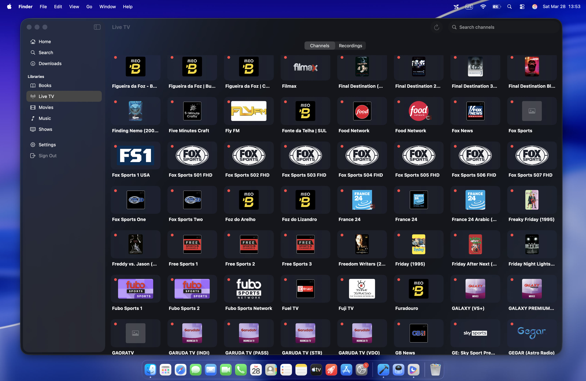
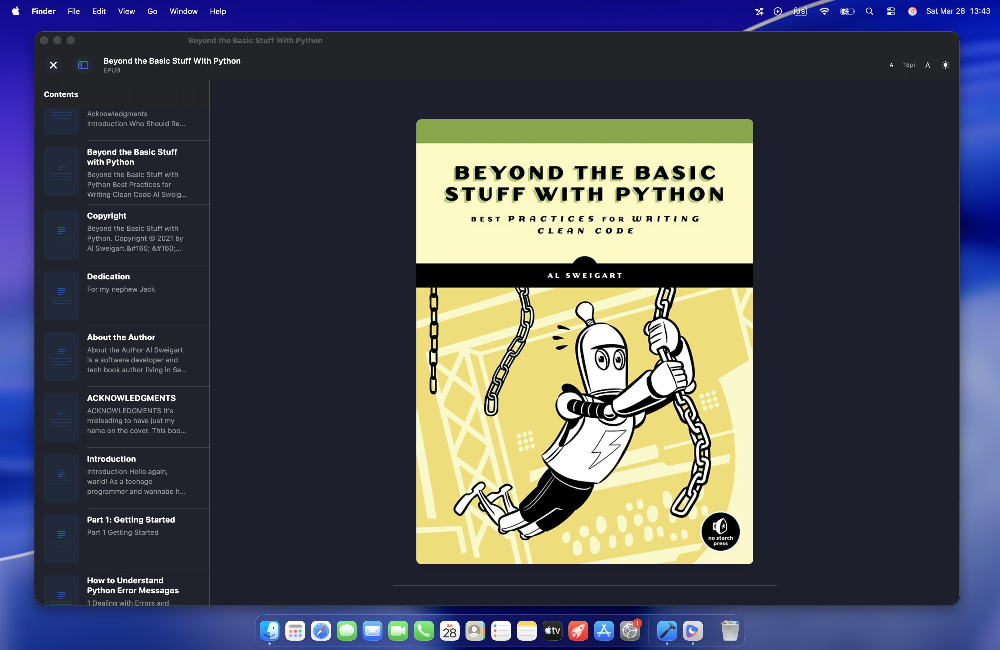
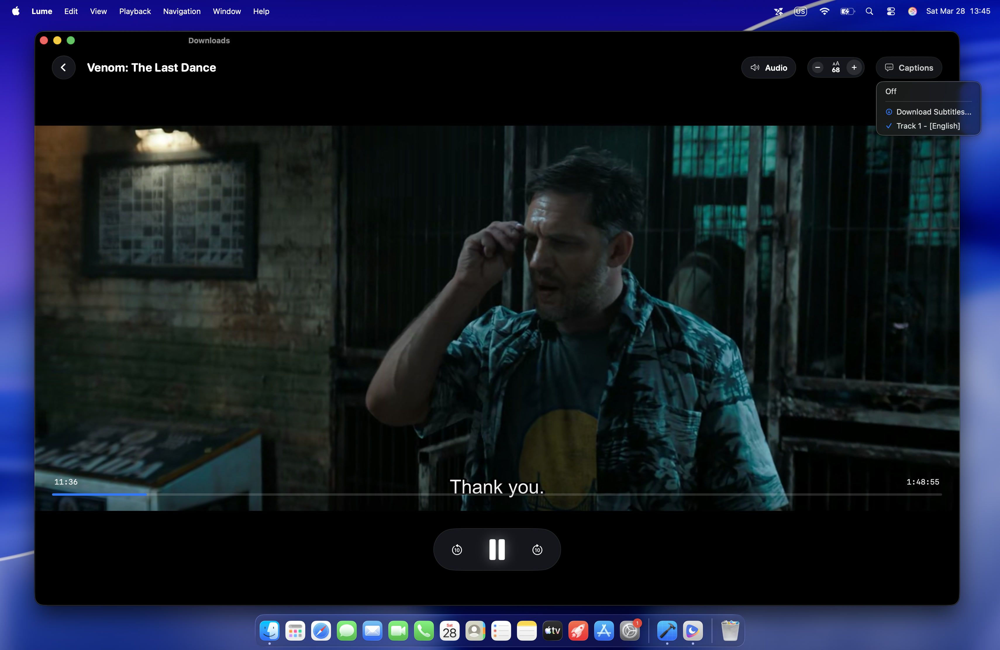
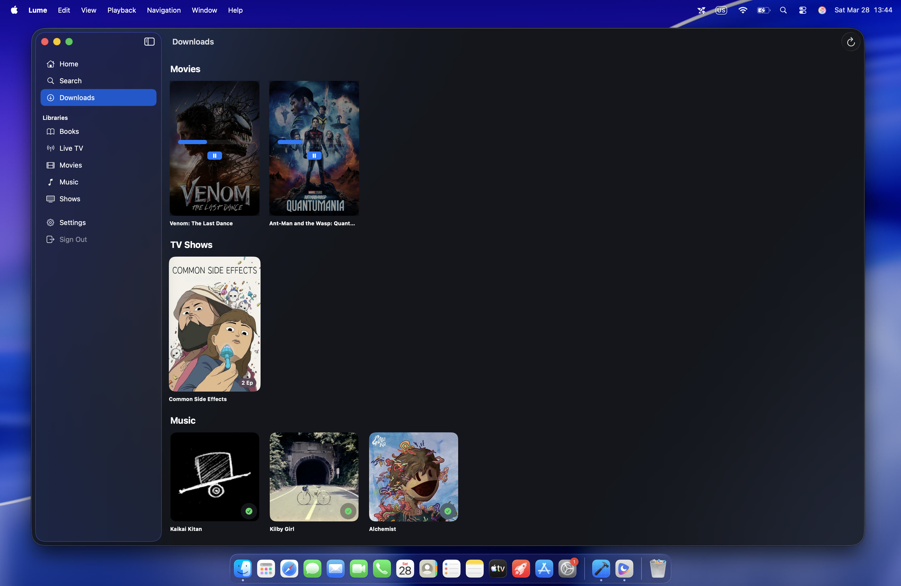
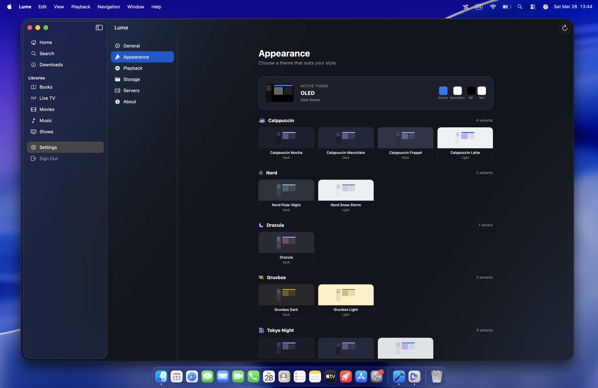
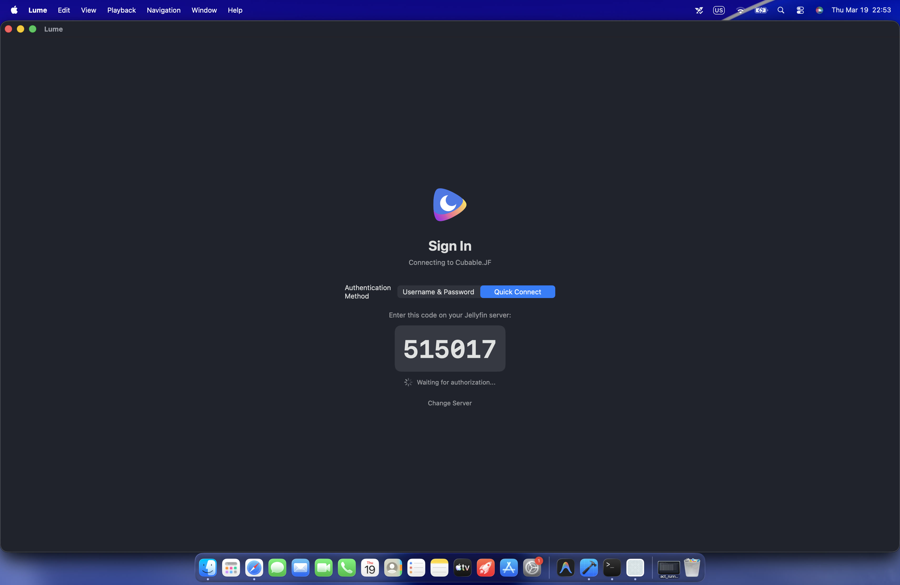

# Lume

A modern, native Jellyfin client for macOS, designed with a focus on aesthetics, performance, and the premium Mac experience.



## 🌟 Features

*   **Native & Fast**: Built from the ground up with **SwiftUI** and **SwiftData** for a lightning-fast, resource-efficient experience tailored specifically for macOS.
*   **VLC Playback Engine**: Powered by **VLCKit** for robust support of virtually any video format, including HDR content, hardware decoding, and precise audio/subtitle track switching.
*   **Offline Downloads**: A professional download manager that supports background transfers, pausing/resuming, and offline playback of your favorite movies and shows.
*   **Aesthetic "Liquid" Design**: A premium interface featuring glassmorphism, vibrant gradients, and smooth animations that feel right at home on Sequoia and beyond.
*   **Comprehensive Media Support**:
    *   **Movies & TV**: Detailed metadata, "Next Up" tracking, and seasonal organization.
    *   **Music**: High-fidelity music browsing with categorized lists (Albums, Artists, Playlists).
    *   **Live TV**: Access your IPTV channels and live recordings directly.
    *   **Books**: A built-in reader for your e-book collections.
*   **Advanced Subtitle System**: Native support for embedded and external `.srt` files, synchronized with Jellyfin, including customizable font sizes and automatic language matching.
*   **Quick Connect**: Seamless login experience using **Device Code** for secure and effortless server pairing.
*   **Themes**: Multiple curated flavors (Dark, Light, Slate, Forest, etc.) to customize your experience.

## 📸 Screenshots

| Home | Movies |
| :---: | :---: |
|  |  |

| TV Shows | Music |
| :---: | :---: |
|  |  |

| Live TV | Books |
| :---: | :---: |
|  |  |

| Video Player | Downloads |
| :---: | :---: |
|  |  |

| Settings | Quick Connect |
| :---: | :---: |
|  |  |

## 🚀 Getting Started

### Prerequisites

*   macOS 26.0 or later.
*   A running **Jellyfin** server.

### Installation

1.  Download the latest **Lume.dmg** from the [Releases](https://git.cubable.date/CustomIcon/Lume/releases) page.
2.  Open the DMG and drag **Lume** to your **Applications** folder.
3.  Launch Lume and enter your server URL to begin the onboarding process.
4.  *Note: If you encounter a security warning, run `xattr -d com.apple.quarantine /Applications/Lume.app` in Terminal.*

## 🛠 Development

Lume is built with modern Apple technologies:

*   **SwiftUI**: For the entire user interface.
*   **SwiftData**: For local persistence and caching.
*   **VLCKit**: For the media playback engine.
*   **SessionManager**: Custom logic for managing Jellyfin API interactions.

### Building from Source

1.  Clone the repository:
    ```bash
    git clone https://git.cubable.date/CustomIcon/Lume.git
    ```
2.  Open `Lume.xcodeproj` in **Xcode 15.0+**.
3.  Ensure the **VLCKit** Swift Package is resolved.
4.  Build and Run (`Cmd + R`).

## 📄 AI / LLM usage DISCLAIMER

This project is partially developed with the help of AI (Antigravity). This includes logic implementation for VLCKit, subtitle synchronization, and the initial creation of certain documentation files. Core architecture and design directions are human-driven.

## 📄 License

This project is licensed under the MIT License - see the LICENSE file for details.
